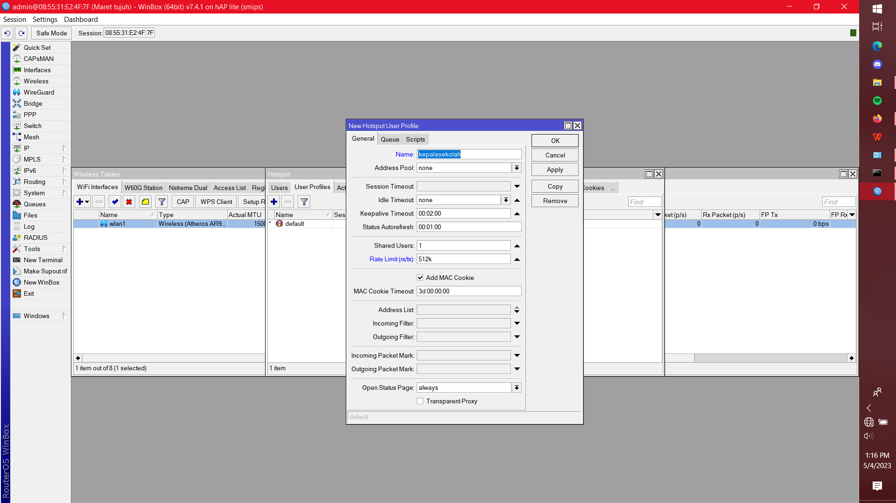
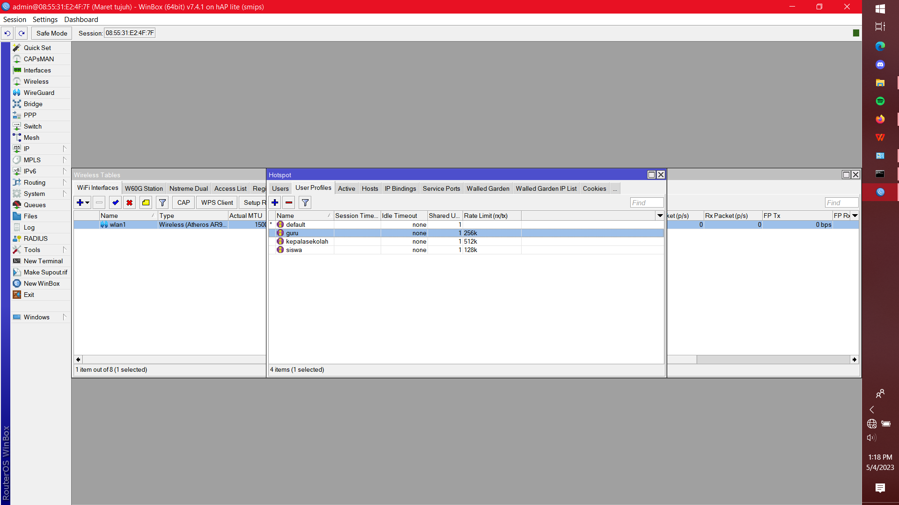
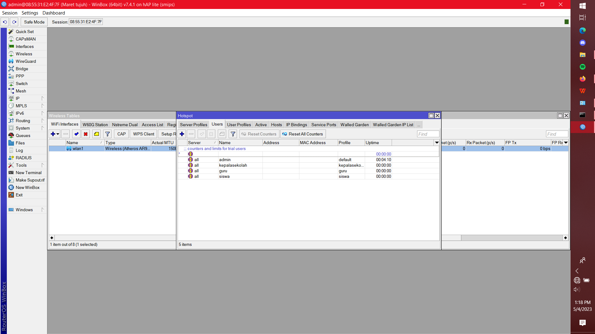
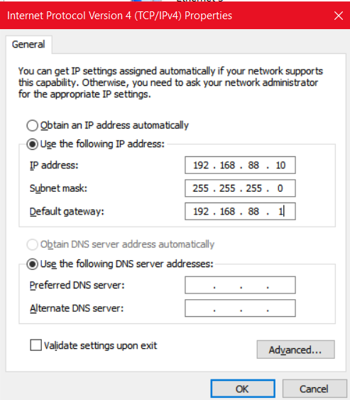
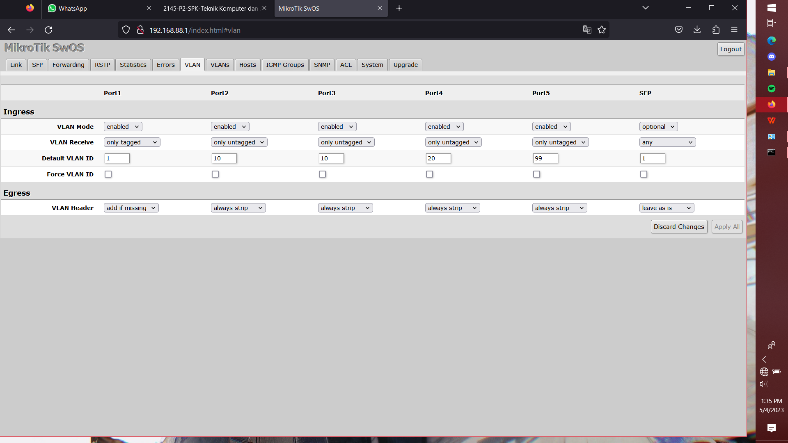

# Ujikom-P2-2021-2022
Pengerjaan Ujikom TKJ Paket 2 Tahun 2021 2022

# Berikut langkah-langkah pengerjaan UJIKOM Paket 2 TKJ
Perangkat yang akan saya gunakan pada pengerjaan UJIKOM ini adalah Router Mikrotik serta Switch Manageable Mikrotik.

# Konfigurasi Router:

## Membuat VLAN pada Interface Trunk

Buatlah virtual interface vlans pada ether2 sesuai dengan yang tertulis di soal
1. Interface bernama Siswa dengan vlan 10 pada ether2.
2. Interface bernama Guru dengan vlan 20 pada ether2.

## Pemberian IP
1. Interface Siswa dengan ip 192.168.40.1/24
2. Interface Guru dengan ip 192.168.60.1/24
3. Interface WLAN dengan ip 192.168.20.1/24

## Pembuatan DHCP Server

Buatlah DHCP Server pada interface yang telah diberikan IP Address

## Konfigurasi WLAN

1. Buatlah Security Profile WPA2/PSK dengan password 12345678
2. Nyalakan Interface WLAN dan ubah security profile dengan yang baru dibuat
3. Ubah mode Interface WLAN menjadi AP Bridge
4. Sesuaikan nama SSID dengan yang di soal

## Konfigurasi Hotspot

1. Jalankan Hotspot Setup pada Interface WLAN
2. Klik Next hingga muncul opsi DNS Name
3. Ubahlah DNS Name sesuai yang tertulis dalam soal (portalsmkbi.sch.id)

4. Lalu Klik Next hingga Hotspot Setup tersebut selesai.

### Membuat User Profile
1. Pada tab User Profile buatlah User Profile baru dengan nama kepalasekolah
2. Dan tambahkan rate limit untuk membatasi kecepatan up/down internet untuk user kepalasekolah sesuai dengan permintaan soal   
yaitu 512k/512k atau 512k saja
3. lalu ulangilah dua step diatas untuk user yang lain

### Membuat User
1. Tambahkan User Baru dan sesuaikan nama user tersebut dengan yang ada pada soal
2. Lalu gantilah User Profile User yang baru dibuat itu sesuai dengan nama yang diberikan   
Misalnya User Baru Siswa berarti User Profilenya juga Siswa.

## Menghubungkan Router Dengan Internet (NAT)

1. Pergi ke sidebar IP/Firewall
2. Pergi ke bagian menu bar NAT
3. Tambahkan NAT Rule baru
4. Ubah Bagian Chain menjadi srcnat,   
out. interface menjadi ether1 (interface yang terhubung dengan internet)

5. Lalu pergilah ke tab Action pada NAT Rule baru tersebut
6. Dan ubahlah action tersebut menjadi masquerade

# Konfigurasi Switch:

## Gunakan Static IP untuk mengakses Switch

1. Pertama konfigurasi kan interface lan pada perangkat yang terhubung ke switch menggunakan ip static dalam network 192.168.88.0/24 sehingga dapat terhubung dengan switch   
pada contoh 192.168.88.10 akan digunakan

2. Lalu bukalah internet browser yang kalian pakai dan ketikan ip switch pada address bar (192.168.88.1)
3. Setelah itu pindah ke menu VLAN pada menu bar di atas
4. lalu konfigurasikan setiap port tersebut sesuai dengan soal hiraukan port 5 karena port 5 tidak akan dipakai

> Note: VLAN receive only tagged/trunk hanya digunakan untuk port yang ingin menyalurkan lebih dari 1 vlan melalui satu kabel.
> Default VLAN ID adalah VLAN ID sesuai dengan Virtual Interface yang telah dibuat pada router yaitu siswa 10, dan guru 20
> Dan pada bagian VLAN Header Add if missing hanya digunakan untuk only tagged/trunk sedangkan always strip hanya digunakan untuk port yang ingin diberi VLAN atau port akses