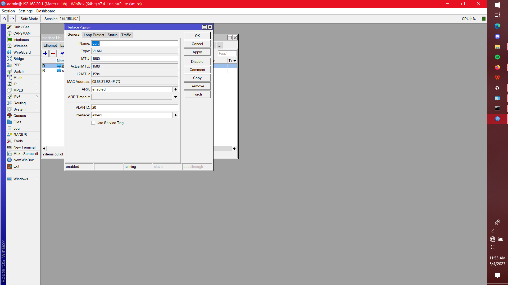
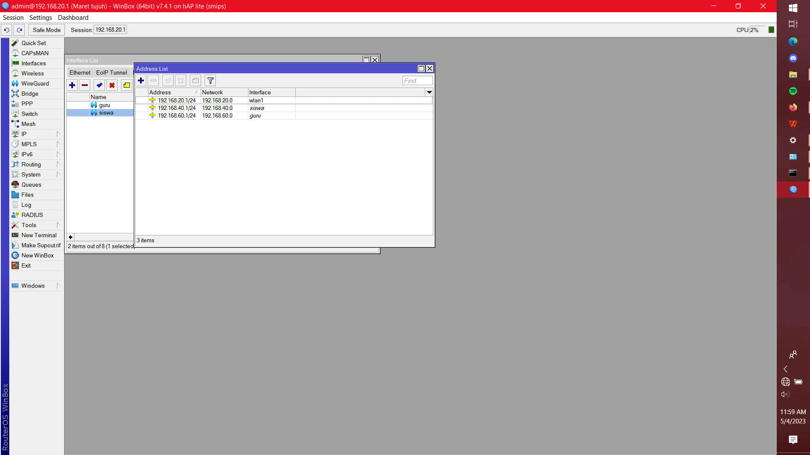
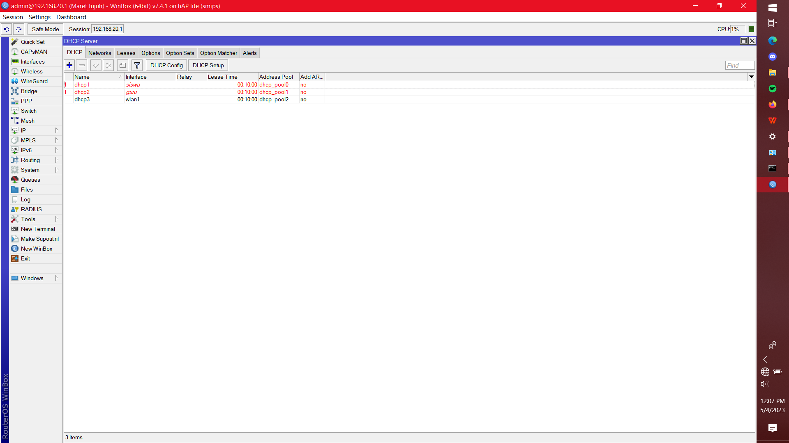
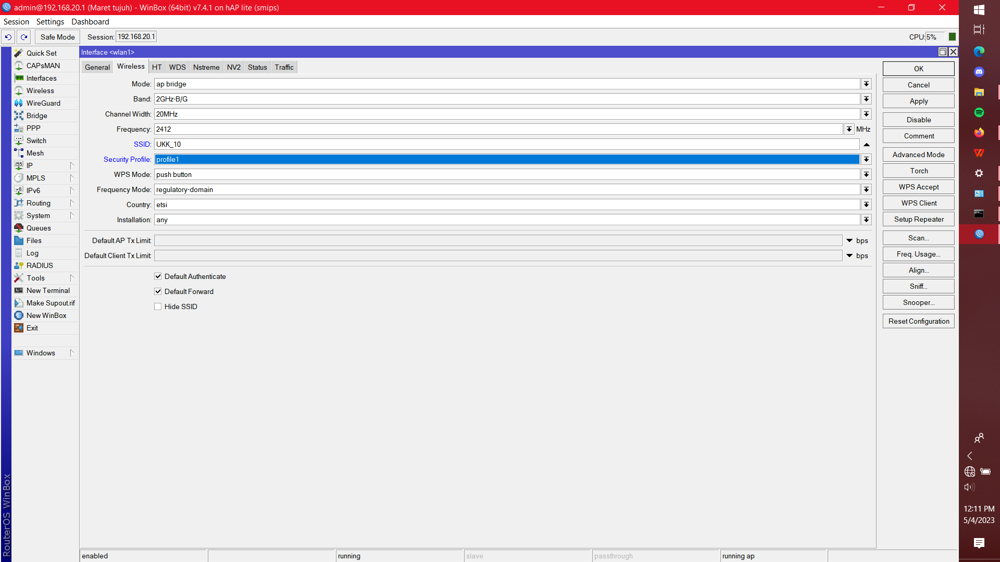
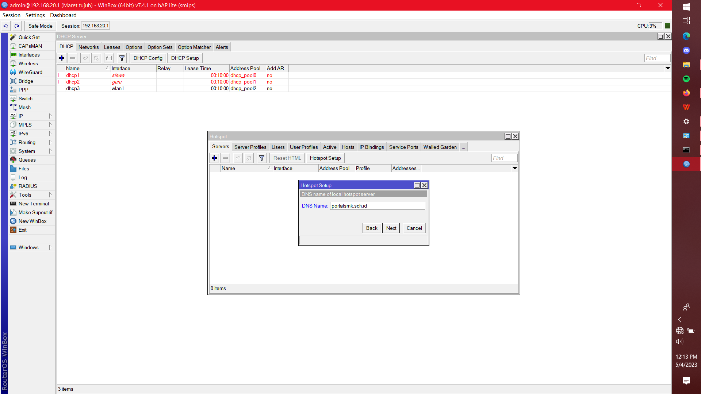
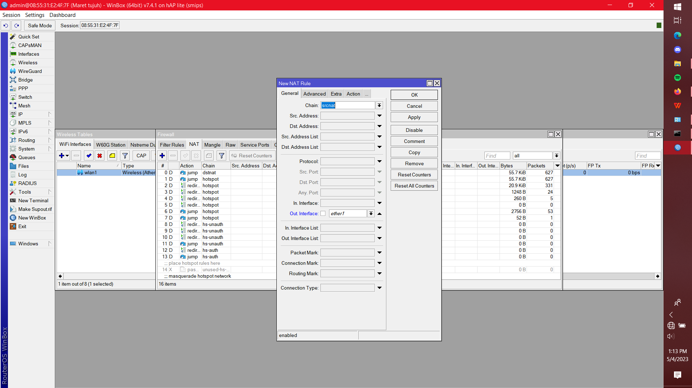
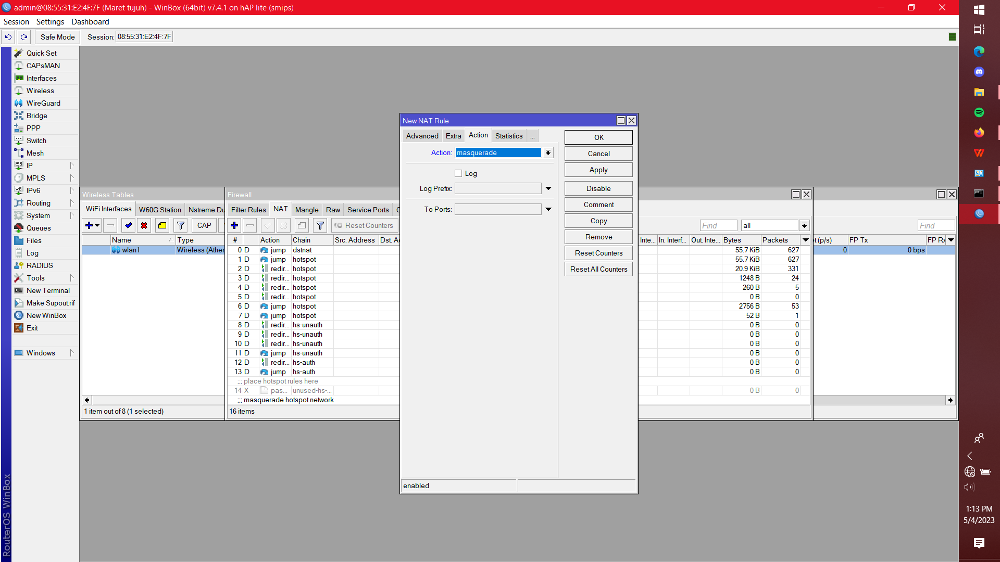

# Ujikom-P2-2021-2022
Pengerjaan Ujikom TKJ Paket 2 Tahun 2021 2022

# Berikut langkah-langkah pengerjaan UJIKOM Paket 2 TKJ

## Membuat VLAN pada Interface Trunk

Buatlah virtual interface vlans pada ether2 sesuai dengan yang tertulis di soal
1. Interface bernama Siswa dengan vlan 10 pada ether2.
2. Interface bernama Guru dengan vlan 20 pada ether2.

## Pemberian IP
1. Interface Siswa dengan ip 192.168.40.1/24
2. Interface Guru dengan ip 192.168.60.1/24
3. Interface WLAN dengan ip 192.168.20.1/24

## Pembuatan DHCP Server

Buatlah DHCP Server pada interface yang telah diberikan IP Address

## Konfigurasi WLAN

1. Buatlah Security Profile WPA2/PSK dengan password 12345678
2. Nyalakan Interface WLAN dan ubah security profile dengan yang baru dibuat
3. Ubah mode Interface WLAN menjadi AP Bridge
4. Sesuaikan nama SSID dengan yang di soal

## Konfigurasi Hotspot

1. Jalankan Hotspot Setup pada Interface WLAN
2. Klik Next hingga muncul opsi DNS Name
3. Ubahlah DNS Name sesuai yang tertulis dalam soal (portalsmkbi.sch.id)

4. Lalu Klik Next hingga Hotspot Setup tersebut selesai.

## Menghubungkan Router Dengan Internet (NAT)

1. Pergi ke sidebar IP/Firewall
2. Pergi ke bagian menu bar NAT
3. Tambahkan NAT Rule baru
4. Ubah Bagian Chain menjadi srcnat,   
out. interface menjadi ether1 (interface yang terhubung dengan internet)

5. Lalu pergilah ke menu Action pada NAT Rule baru tersebut
6. Dan ubahlah action tersebut menjadi masquarde

